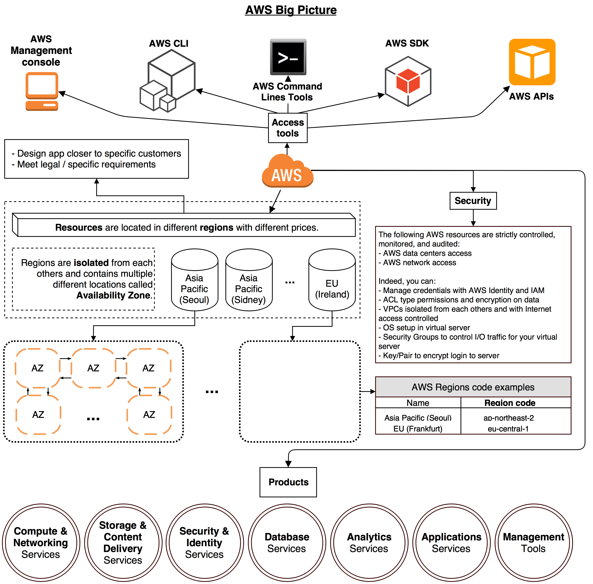
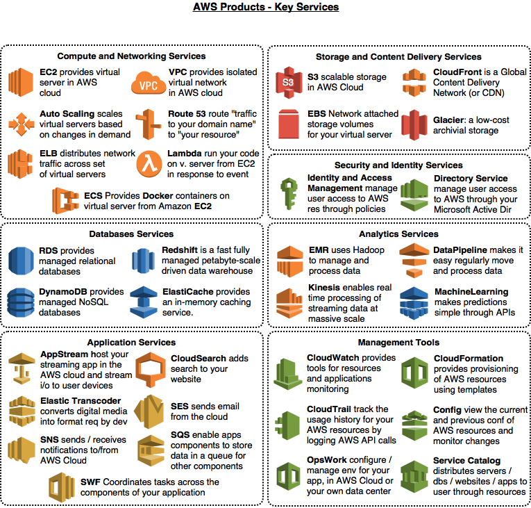

## A draw.io-maps based guide

This repo is intended as a collection of reference note to AWS service.

### Contents
todo yet

### Credits & Sources

- [amazon.com](https://amazon.com)
- [kindle-format aws guide](https://www.amazon.com/Amazon-Web-Services/e/B007R6MVQ6)

#### Big picture

This is a big picture of AWS:



AWS provides services in different parts of the world: for this reason, _AWS products_ are available in different _Regions_. Each region contains multiple distinct _Availability Zones_. Each Region is isolated from failures in others. Each Availability Zone is isolated from failures in others. You can use region and availability zone to meet legal requirements, provide services closer to specific customers and so on. Note: not every Region / Availability Zone supports every _AWS resource_. Prices in each Regione are different.

### Products

The main products in AWS environment are:

- Compute and Networking Services
- Storage and Content Delivery Services
- Security and Identity Services
- Database Services
- Analytics Services
- Application Services
- Management Tools

This is a picture with listed AWS products and key services:



With the help of starting guide provided by Amazon, we go more in deep analyzing key services for each group of products. 

### Compute and Networking Services

This set of services are related to compute and networking functions: the following key services are available:
- __Amazon EC2__ or __Amazon Elastic Compute Cloud__
- __Amazon VPC__ (and subnets)
- __Amazon Route 53__ Hosted Zones
- __Amazon Auto Scaling Group__
- __Amazon ELB__ or __Amazon Elastic Load Balancer__
- __Amazon ECS__ or __Amazon Elastic Container Service__

##### Amazon EC2

EC2 provides scalable computing capacity (amazon servers in amazon datacenters) to build and host your app. EC2 works with __Amazon Machine Image__ or __AMI__: an "AMI" is an image template with software configuration inside like OS, webserver, specific applications, and so on. You create _instance(s)_ starting from _AMI_: in this sense, _AMI_ stays to [docker](https://docker.com) image as _instance_ stays to docker container. An _instance_ is no more than a copy of _AMI_ running as a VM in Amazon Datacenter. When you decide to create you instance, you can choose what type of host computer (in term of physical resources) you need: CPU, memory, etc.
Each Amazon _instance_ has its own public __IP address__ and public __DNS name__: the last follows the rules above:
- For _instances_ running in _Availability Zones_ in US East (N. Virginia) Region, the DNS name has the following pattern: ```ec2-[public_ip].compute-1.amazonaws.com```
- For all other _instances_, DNS name has the following pattern:
```ec2-[public_ip].[public_ip].compute.amazonaws.com```

You can ignore how instances work: they simply keep running until fail. They don't restart automatically if fails occurs. To better meet your / your customers' requirements, you can buildi your own _AMI_ image starting from the repo of _AMI_ and choosing the one that best fits your needs. Than, you can customize it adding more resources / applications in it.

### Storage and Content Delivery Services
todo yet

### Security and Identity Services
todo yet

### Database Services
todo yet

### Analytics Services
todo yet

### Application Services
todo yet

### Management Tools
todo yet