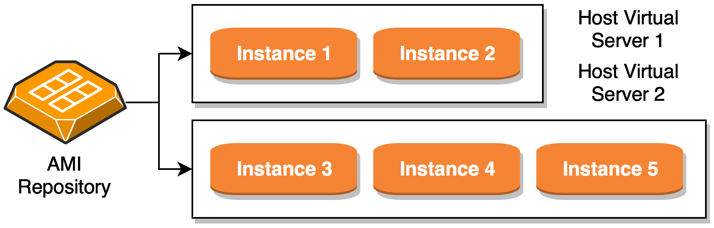

# My Personal AWS Guide

This repo is intended as a collection of reference notes and summaries of AWS services. I used [draw.io](https://draw.io) and [dillinger.io](https://dillinger.io) as open source web-based map tool and official Amazon guides.

## Contents

[[1] Credits & Sources](#creditsandsources)

[[2] Products](#products)

[[2.1] Compute and Networking Services](#cns)

[[2.2] Storage and Content Delivery Services](#scds)

[[2.3] Security and Identity Services](#sis)

[[2.4] Database Services](#ds)

[[2.5] Analytics Services](#as)

[[2.6] Application Services](#aps)

[[2.7] Management Tools](#mt)

### <a name="creditsandsources"></a>Credits & Sources

- [amazon.com](https://amazon.com)
- [kindle-format aws guide](https://www.amazon.com/Amazon-Web-Services/e/B007R6MVQ6)

## Big picture

This is a big picture of AWS:


AWS provides services in different parts of the world: for this reason, _AWS products_ are available in different _Regions_. Each region contains multiple distinct _Availability Zones_. Each Region is isolated from failures in others. Each Availability Zone is isolated from failures in others. You can use region and availability zone to meet legal requirements, provide services closer to specific customers and so on. Note: not every Region / Availability Zone supports every _AWS resource_. Prices in each Regione are different.

## <a name="products"></a>Products

The main products in AWS environment are:

- Compute and Networking Services
- Storage and Content Delivery Services
- Security and Identity Services
- Database Services
- Analytics Services
- Application Services
- Management Tools

This is a picture with listed AWS products and key services:


With the help of starting guide provided by Amazon, we go more in deep analyzing key services for each group of products. 

### <a name="cns"></a>Compute and Networking Services

This set of services are related to compute and networking functions: the following key services are available:
- __Amazon EC2__ or __Amazon Elastic Compute Cloud__
- __Amazon VPC__ (and subnets)
- __Amazon Route 53__ Hosted Zones
- __Amazon Auto Scaling Group__
- __Amazon ELB__ or __Amazon Elastic Load Balancer__
- __Amazon ECS__ or __Amazon Elastic Container Service__

#### Amazon EC2

You can use Amazon EC2 to launch as many or as few virtual servers as you need, configure security and networking, and manage storage. EC2 provides scalable computing capacity (amazon servers in amazon datacenters) to build and host your app. EC2 works with __Amazon Machine Image__ or __AMI__: an "AMI" is an image template with software configuration inside like OS, webserver, specific applications, and so on. You create _instance(s)_ starting from _AMI_. An _instance_ is no more than a copy of _AMI_ running as a VM in Amazon Datacenter. When you decide to create you instance, you can choose what type of host computer (in term of physical resources) you need: CPU, memory, etc. See AMIs & Instances section below for more details.

<p>
	
</p>

Each Amazon _instance_ has its own public __IP address__ and public __DNS name__: the last follows the rules above:
- For _instances_ running in _Availability Zones_ in US East (N. Virginia) Region, the DNS name has the following pattern:
```
ec2-[public_ip].compute-1.amazonaws.com
```
- For all other _instances_, DNS name has the following pattern:
```
ec2-[public_ip].[region_code].compute.amazonaws.com
```

You can ignore how instances work: they simply keep running until fail. They don't restart automatically if fails occurs. To better meet your / your customers' requirements, you can buildi your own _AMI_ image starting from the repo of _AMI_ and choosing the one that best fits your needs. Than, you can customize it adding more resources / applications in it.

##### Glossary, Keywords & Features

- __Instances__: Virtual computing environments
- __Amazon Machine Images (AMIs)__: preconfigured templates for your instances, that package the bits you need for your server (including the operating system and additional software)
- __Instances types__: various configurations of CPU, memory, storage, and networking capacity for your instances
- __Key Pairs__: secure login information to log into your instances (AWS stores the public key, and you store the private key in a secure place)
- __Instance Store Volumes__: storage volumes for temporary data that's deleted when you stop or terminate your instance
- __Amazon EBS volumes__: persistent storage volumes for your data using Amazon Elastic Block Store (Amazon EBS)
- __Regions and Availability Zones__: multiple physical locations for your resources, such as instances and Amazon EBS
- __Security Groups__: a firewall that enables you to specify the protocols, ports, and source IP ranges that can reach your instances
- __Elastic IP addresses__: static IPv4 addresses for dynamic cloud computing
- __Tags__: metadata that you can create and assign to your Amazon EC2 resources
- __Virtual networks__: VN that you can create that are logically isolated from the rest of the AWS cloud, and that you can optionally connect to your own network, known as virtual private clouds (VPCs)

##### AMIs & Instances

As we said, an Amazon Machine Image (AMI) is a template that contains a software configuration (for example, an operating system, an application server, and applications). From an AMI, you launch an instance, which is a copy of the AMI running as a virtual server in the cloud. You can launch multiple instances of an AMI. You can launch different types of instances from a single AMI. An instance type essentially determines the hardware of the host computer used for your instance. Each instance type offers different compute and memory capabilities. Select an instance type based on the amount of memory and computing power that you need for the application or software	that you plan to run on the instance. When you launch an instance, the __root device volume contains__ the image used to boot the instance. A long time ago all AMIs were backed by Amazon EC2 instance store, which means the root device for an instance launched from the AMI was an instance store volume created from a template stored in __Amazon S3__. After, Amazon introduced __Amazon EBS__ (Elastic Block Store) so AMIs are now backed by Amazon EBS. 

    This means that the root device for an instance launched from the AMI is an Amazon EBS volume created from an Amazon EBS snapshot.

Your instance may include local storage volumes, known as instance store volumes, which you can configure at launch time with __block device mapping__. Amazon EC2 supports two types of block devices:
- Instance store volumes (virtual devices whose underlying hardware is physically attached to the host computer for the instance)
- EBS volumes (remote storage devices)

A block device mapping defines the block devices (instance store volumes and EBS volumes) to attach to an instance. You can specify a block device mapping as part of creating an AMI so that the mapping is used by all instances launched from the AMI. Alternatively, you can specify a block device mapping when you launch an instance, so this mapping overrides the one specified in the AMI from which you launched the instance.

##### Step By Step


#### Amazon VPC

Amazon _Virtual Private Cloud_ is a virtual network dedicated to your AWS account. It is logically isolated from other virtual network. You can use _subnets_ to split IP(s) range and group (run) _istances_ to handle security and computational needs.
Note: VPC is isolated from outside world by default. If you want a subnet to reach _www_, you need to add an __Internet Gateway__ AND a __route table__ to the Internet and the subnet. Starting from the end of 2013, a default VPC is created with your account. That means that every EC2 instances run in a VPC (default or non-default).

TODO: add schema and screenshots of VPC setup

##### Security Group

A security group acts like _iptable_: for each instance, you can create a security group with two separate set of rules, one for inbound and one for outbound traffic. If a connection doesn't match any in/out rules, then it will be discarded.

#### Amazon Route 53

Route 53 is a DNS web service: it permits you to create redirect from your personal domain name(s) to AWS assigned urls. Infact, each time you create a Resource, AWS assign to it a domain name. Route 53 resolve this name to the IP address of the resource itself. If you have a personal domain name, you can transfer it to Route 53: if you don't have it you can pick one from available in Route 53.

##### Hosted Zones

A hosted zone is a collection of resource record sets for a specified domain. You create a hosted zone for a domain (such as example.com), and then you create resource record sets to tell the Domain Name System how you want traffic to be routed for that domain.

When you create a hosted zone, Amazon Route 53 automatically creates a name server (NS) record and a start of authority (SOA) record for the zone. The NS record identifies the four name servers that you give to your registrar or your DNS service so that DNS queries are routed to Amazon Route 53 name servers.

#### Auto Scaling Group


### <a name="scds"></a>Storage and Content Delivery Services
todo yet

### <a name="sis"></a>Security and Identity Services
todo yet

### <a name="ds"></a>Database Services
todo yet

### <a name="as"></a>Analytics Services
todo yet

### <a name="aps"></a>Application Services
todo yet

### <a name="mt"></a>Management Tools
todo yet