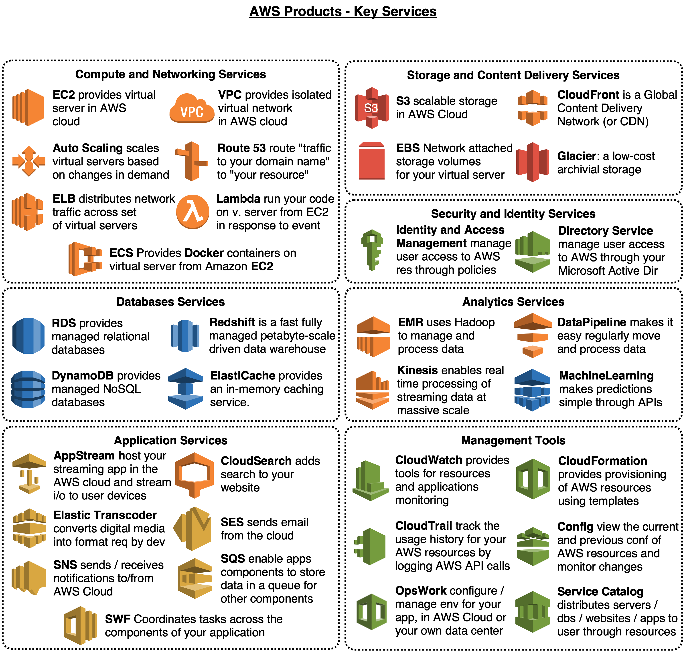

## A draw.io-maps based guide

This repo is intended as a collection of reference note to AWS service.

### Contents
todo yet

### Credits & Sources

- [amazon.com](https://amazon.com)
- [kindle-format aws guide](https://www.amazon.com/Amazon-Web-Services/e/B007R6MVQ6)

#### Big picture

This is a big picture of AWS:

AWS provides services in different parts of the world: for this reason, _AWS products_ are available in different _Regions_. Each region contains multiple distinct _Availability Zones_. Each Region is isolated from failures in others. Each Availability Zone is isolated from failures in others. You can use region and availability zone to meet legal requirements, provide services closer to specific customers and so on. Note: not every Region / Availability Zone supports every _AWS resource_. Prices in each Regione are different.

### Products

The main products in AWS environment are:

- Compute and Networking Services
- Storage and Content Delivery Services
- Security and Identity Services
- Database Services
- Analytics Services
- Application Services
- Management Tools

This is a picture with listed AWS products and key services:

With the help of starting guide provided by Amazon, we go more in deep analyzing key services for each group of products. 

### Compute and Networking Services
todo yet

### Storage and Content Delivery Services
todo yet

### Security and Identity Services
todo yet

### Database Services
todo yet

### Analytics Services
todo yet

### Application Services
todo yet

### Management Tools
todo yet